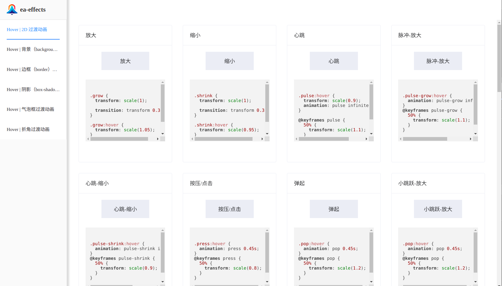
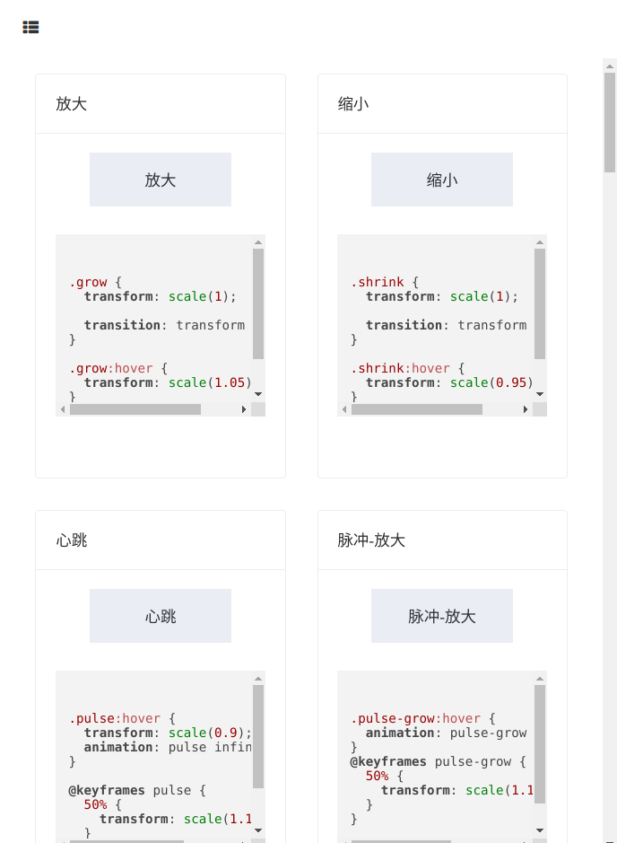

# Easy-effects

`Easy-effects` 是基于 `css3` 的样式、过渡、动画的尝试实现

> 模仿自 [Hover.css](https://ianlunn.github.io/Hover/) 和 [Animate.css](https://animate.style/) 库的，因为是看效果自己实现，所以可能有些动画实现的代码没有像这些库一样精简、完美

## 前言

该项目算是自己的一个 `css` 尝试（？练习）。但是毕竟 `css` 这种是可以通过控制台看的，就算只是想要证明是自己写的也会很困难 😂。所以，无所谓啦，清者自清嘛。

## 该文档是干嘛的？

因为是当作一种类似练习而写的，所以也没有像提及的这几个动画库一样，将所有样式整合成一个文件。算是方便快速浏览学习吧。

